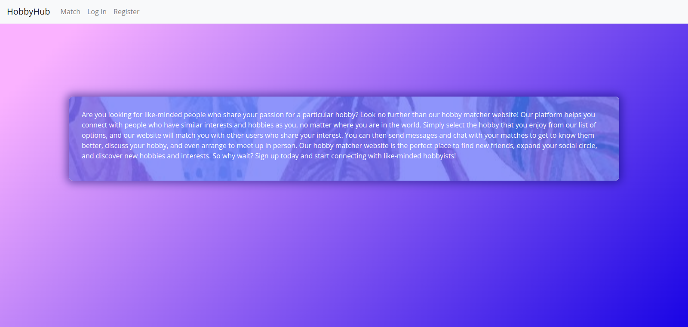
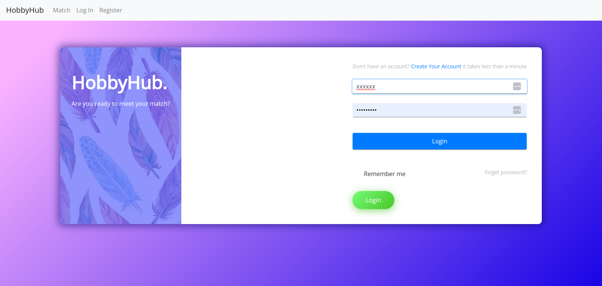

# HobbyHub

HobbyHub is a web app that helps you find people who share your hobbies and interests. With HobbyHub, you can connect with other hobbyists, exchange messages, and make new friends.

## Installation

To install HobbyHub, simply clone the repository and run the following command:

npm install

This will install all the necessary dependencies for the app to run.

## Usage

To start the app, run the following command:

npm start

This will launch the app in your default browser.

## Features

- Select your hobby from a list of options
- Find other users who share your interest
- Send messages to your matches
- Update your profile with your hobbies and interests
- View your matches' profiles

## Technologies Used

- React.js
- Node.js
- Express.js
- MongoDB
- Socket.IO
- Bootstrap

## Contributing

Contributions to HobbyHub are always welcome! If you would like to contribute, please create a pull request with your changes.

## License

HobbyHub is released under the MIT License. See `LICENSE` for more information.

## Contact

If you have any questions or suggestions for HobbyHub, please contact us at support@HobbyHub.com.

### images

